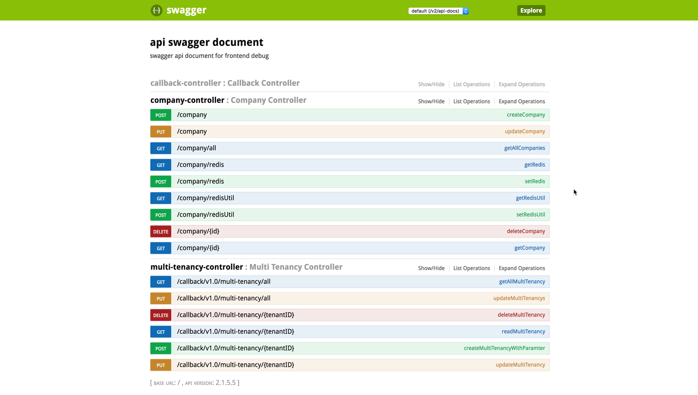

# Overview

npm install --registry=http://nexus.wdf.sap.corp:8081/nexus/content/groups/build.milestones.npm --proxy=null

## Architecture

* When update company information ,meanwhile sync it to the redis to cache.
* Get company information,firstly get it in the redis , if there is no data to return ,then get it from the hana and sync it to the redis to cache
* Delete company information,meanwhile delete it in the redis
* 
## API List
https://ems-srv-demo.cfapps.sap.hana.ondemand.com/swagger-ui.html#/

## Table Contents

* [1.Create service](Step1-create-service.MD).

* [2.Database onboarding](Step2-database-onboarding.MD).

* [3.Redis](Step3-redis.MD).

* [4.MQ](Step4-Mq.MD).

* [5.Performance](Step5-performance.md).

* [6.Dynatrace](Step6-dynatrace.md).
