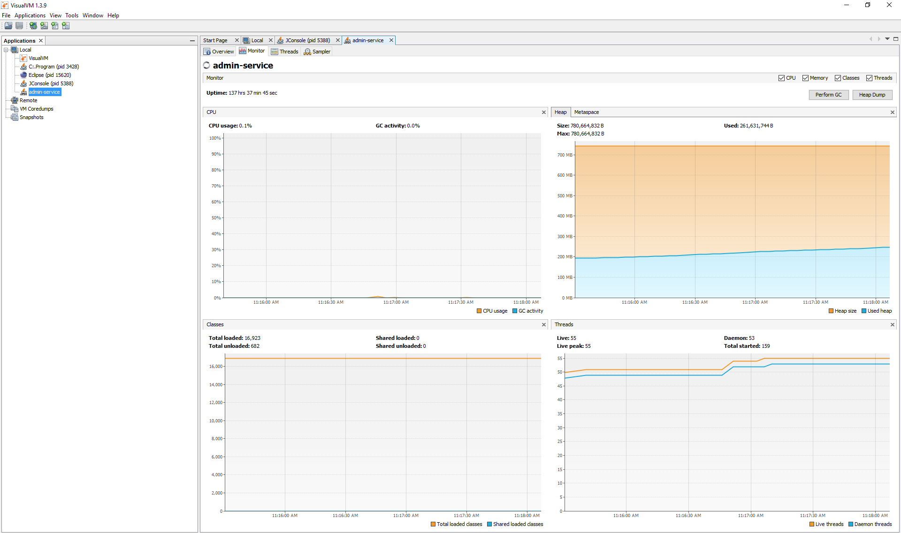

# How to use jConsole in CF

##  buildpack: sap_java_buildpack

* enable JMX

cf set-env <<Your Application>> JBP_CONFIG_JAVA_OPTS "{\"java_opts\":\" -Djava.rmi.server.hostname=localhost -Dcom.sun.management.jmxremote.authenticate=false -Dcom.sun.management.jmxremote.ssl=false -Dcom.sun.management.jmxremote.port=5000 -Dcom.sun.management.jmxremote.rmi.port=5000 -XX:+PrintGCDetails -XX:+PrintGCDateStamps -XX:+GCHistory -XX:+DumpGCHistoryOnOutOfMemory -XX:+DumpDetailedClassStatisticOnOutOfMemory -XX:+PrintConcurrentLocks -XX:LogGcMaxFileSize=5000000\"}"
  
```
cf set-env ems-srv-demo JBP_CONFIG_JAVA_OPTS "{\"java_opts\":\" -Djava.rmi.server.hostname=localhost -Dcom.sun.management.jmxremote.authenticate=false -Dcom.sun.management.jmxremote.ssl=false -Dcom.sun.management.jmxremote.port=5000 -Dcom.sun.management.jmxremote.rmi.port=5000 -XX:+PrintGCDetails -XX:+PrintGCDateStamps -XX:+GCHistory -XX:+DumpGCHistoryOnOutOfMemory -XX:+DumpDetailedClassStatisticOnOutOfMemory -XX:+PrintConcurrentLocks -XX:LogGcMaxFileSize=5000000\"}"

```

* restage <<Your Application>>
  
```
restage ems-srv-demo

```

## buildpack: default 

* enable JMX

```
cf set-env ems-srv-demo JAVA_OPTS "-XX:-PrintGC -XX:-PrintGCDetails -XX:-PrintGCTimeStamps -XX:-HeapDumpOnOutOfMemoryError -Xloggc:gc.log -verbose:gc"  && cf restage ems-srv-demo

ems-srv-demo i325291$ cf set-env ems-srv-demo JBP_CONFIG_JMX "{\"enabled\": \"true\"}" && cf restage ems-srv-demo       

```
* restage <<Your Application>>
  
```
restage ems-srv-demo
```
* Open ssh tunnel

```
cf ssh -N -T -L 5000:localhost:5000 ems-srv-demo
```

* Jconsole localhost:5000

```
Jconsole localhost:5000
```


* Open visualVM 



## Helpful link
https://github.wdf.sap.corp/Hands-On/Demo/blob/master/How-to-performance.md
